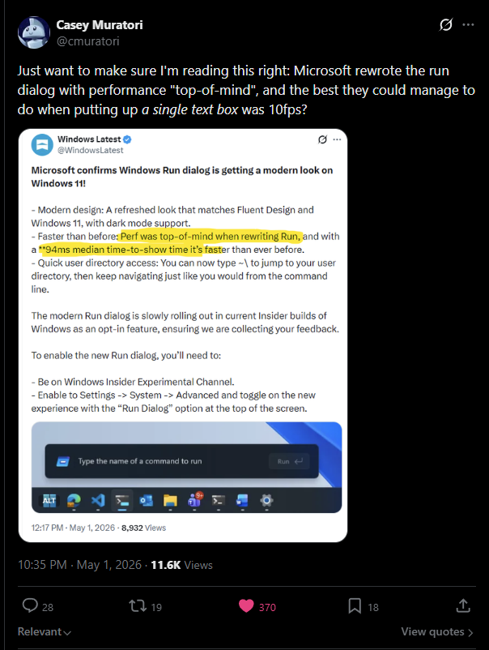

# perf-run

> **Disclaimer:** this repo is AI slop. It was written end-to-end by Claude
> (Opus 4.7) in a single session. The code works and the numbers are real,
> but it has not been carefully reviewed by a human. Trust accordingly.

Measures time-to-show of the classic Windows Run dialog.

## Why

Microsoft announced a rewrite of the Win+R dialog with "performance top-of-mind"
and a quoted **94 ms median time-to-show**. Casey Muratori had thoughts:

> Just want to make sure I'm reading this right: Microsoft rewrote the run
> dialog with performance "top-of-mind", and the best they could manage to do
> when putting up *a single text box* was 10fps?
>
> — [@cmuratori, May 1 2026](https://x.com/cmuratori/status/2050328300745261395)



This tool measures how fast the *existing* (classic, C/Win32) Run dialog shows,
so the rewrite has a baseline to be embarrassed by.

## Result on this machine

200 iterations after a 5-iteration warmup, classic Run dialog
(`rundll32.exe shell32.dll,#61`):

```
  min  :   40.23 ms
  p50  :   48.53 ms
  p90  :   50.34 ms
  p99  :   52.58 ms
  max  :   54.03 ms
  mean :   48.15 ms
```

**~48 ms p50** — about half the 94 ms quoted for the rewrite.

## What it measures

`CreateProcess` → `EVENT_OBJECT_SHOW` for the dialog HWND, captured via a
global `SetWinEventHook` filtered by spawned PID and the `#32770` window class.
Timestamps come from `QueryPerformanceCounter`. The dialog is closed each
iteration with `WM_CLOSE` (not terminated) so the shell's cached state survives
into the next launch.

`EVENT_OBJECT_SHOW` fires when `ShowWindow` is called — a few ms before pixels
actually hit the screen. This matches what most "time-to-show" numbers measure
(presumably including Microsoft's). For true pixels-on-screen timing you would
want DWM ETW present events.

## Build

Requires `clang` (preferred) or MSVC `cl` on PATH.

```
build.bat
```

## Run

```
perf-run.exe [--warmup N] [--n N] [--settle MS] [--presentmon PATH]
```

| flag | default | meaning |
|------|---------|---------|
| `--warmup` | 5 | discard first N iterations (lets shell32 warm up) |
| `--n` | 200 | measured iterations |
| `--settle` | 50 | ms to pause between iterations |
| `--presentmon PATH` | off | also report first-DWM-present time (see below) |

For a cold-cache measurement, use `--warmup 0` immediately after a fresh boot.

### Optional: closer-to-pixels measurement via PresentMon

`--presentmon` adds a second metric: the time from `CreateProcess` to the
first DWM compositor present at or after `EVENT_OBJECT_SHOW`. This is the
closest available proxy for "first frame containing the dialog hits the
screen" — much closer to user-perceived latency than `ShowWindow` alone.

How it works:

1. perf-run spawns [PresentMon](https://github.com/GameTechDev/PresentMon)
   in parallel with an ETW session that records every present from
   `dwm.exe` (the classic Run dialog is GDI, so the *compositor* presents
   the frames containing it — not rundll32).
2. After the run, perf-run sends `CTRL_BREAK` to PresentMon to flush the
   CSV, then parses it. PresentMon's `--qpc_time` column gives absolute
   QPC ticks, directly comparable to `QueryPerformanceCounter` values
   recorded in-process.
3. For each iteration, the first DWM present with `QPC >= t_show` is
   attributed as that iteration's "first frame on screen."

PresentMon discovery: `--presentmon PATH` (explicit), then `PRESENTMON`
env var, then PATH search for `PresentMon.exe` and common scoop-named
variants. Tested against PresentMon 2.4.1.

**ETW requires elevation.** Either run perf-run from an elevated shell,
or add yourself one-time to the `Performance Log Users` group:

```
net localgroup "Performance Log Users" %USERNAME% /add
```

then sign out and back in.

The "first DWM present" metric is *still* a proxy — DWM presents include
many surfaces, and PresentMon doesn't tag presents with their constituent
HWNDs. The first DWM present after `t_show` is the earliest frame that
*could* include our dialog; in practice it's bounded by one composition
frame (~16 ms at 60 Hz vsync) above the true value.

## What this is *not*

The 48 ms vs 94 ms comparison is suggestive, not apples-to-apples. Be
honest about what's different:

- **Different metric.** This tool measures `CreateProcess` →
  `EVENT_OBJECT_SHOW` (the `ShowWindow` call). Microsoft's "time-to-show"
  almost certainly means *user-perceived* latency: keystroke (Win+R) →
  first frame on screen. That includes hotkey dispatch through explorer,
  whatever logic explorer uses to decide what to launch, and DWM
  compositor latency to first present. None of that is measured here.
  `EVENT_OBJECT_SHOW` itself precedes first paint by ~one frame (~16 ms
  at 60 Hz).
- **Different process model.** The new dialog likely isn't spawning
  rundll32 at all — it may be in-process to explorer, or activated as a
  packaged app via a different path with very different startup costs.
- **Steady-state, warm shell.** A 5-iteration warmup leaves shell32,
  comctl32, the rundll32 image, and kernel page cache hot. Microsoft's
  number may include cases this harness doesn't see (cold start, low-mem
  conditions, slow disks).
- **Uncontrolled environment.** No CPU frequency pin, no process priority
  bump, no CPU affinity, no AV exclusion. On a thermally throttled or
  battery-powered laptop these dominate.

The honest framing: *the classic dialog reaches `ShowWindow` in ~48 ms
from `CreateProcess`, on a warm shell, on this machine.* Still a damning
data point against 94 ms — but not the same metric.

## Caveats

- Steady-state, not cold-start. Use `--warmup 0` immediately after a
  fresh boot for a cold measurement.
- This is the *classic* dialog. Measuring the new XAML one needs Insider
  Experimental + the toggle, with the harness pointed at whatever process
  hosts it.
